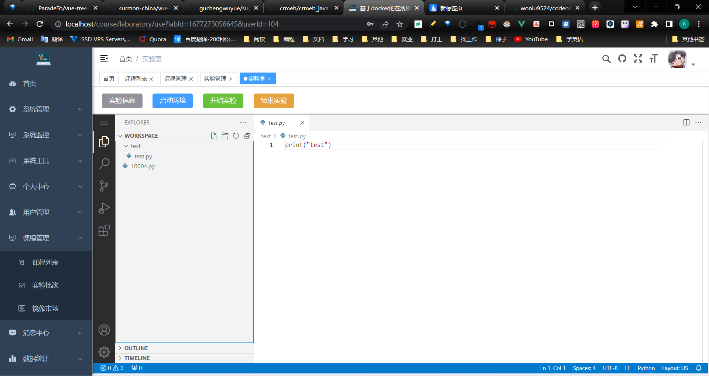

# 基于docker的在线编程平台

## 项目介绍

        

本项目是一个基于docker和k8s搭建的一个在线编程平台，旨在用更轻的方式提供在线编程的学习环境。项目基于若依cloud脚手架搭建，实现了上传镜像，配置实验环境，学生参加实验，老师查看实验，批阅成绩等基本功能。
项目前端：https://github.com/woniu9524/codeonline-frontend

因为时间关系只是实现了基础的功能

## 项目部署

> All in one模式安装kubesphere

参考文档：https://kubesphere.io/zh/docs/v3.3/quick-start/all-in-one-on-linux/

```
# 安装依赖
yum install socat \
yum install conntrack \
yum install ebtables \
yum install ipset
```

```
# 安装kubekey和kubesphere
export KKZONE=cn
curl -sfL https://get-kk.kubesphere.io | VERSION=v3.0.2 sh -
chmod +x kk
./kk create cluster --with-kubernetes v1.22.12 --with-kubesphere v3.3.2

```

```
# 验证安装
kubectl logs -n kubesphere-system $(kubectl get pod -n kubesphere-system -l 'app in (ks-install, ks-installer)' -o jsonpath='{.items[0].metadata.name}') -f
```

> 启用应用市场和devops

参考文档：https://kubesphere.io/zh/docs/v3.3/quick-start/enable-pluggable-components/

> 安装应用

- **harbor**

在应用商店安装harbor教程：https://blog.csdn.net/RaymondCoder/article/details/117689478

默认用户密码：admin Harbor12345

安装完后要配置一下docker：https://blog.csdn.net/liyin6847/article/details/90599612

在/etc/docker/daemon.json下"insecure-registries":["registry的IP地址:端口号"]

- **nacos**

nacos镜像：nacos/nacos-server:v2.1.2

挂载路径：home/nacos/conf/application.properties

- **mysql和redis**在镜像市场安装，过程略

> nfs安装

```
# 在nfs上安装nfs服务
[root@nfs ~]# yum install nfs-utils -y

# 准备一个共享目录
[root@nfs ~]# mkdir /root/data/nfs -pv

# 将共享目录以读写权限暴露给192.168.3.0/24网段中的所有主机
[root@nfs ~]# vim /etc/exports
[root@nfs ~]# more /etc/exports
/root/data/nfs     192.168.3.0/24(rw,no_root_squash)

# 启动nfs服务
[root@nfs ~]# systemctl restart nfs
```

> 流水线

新建devops项目，复制Jenkins文件夹中的流水线


## 功能预览





